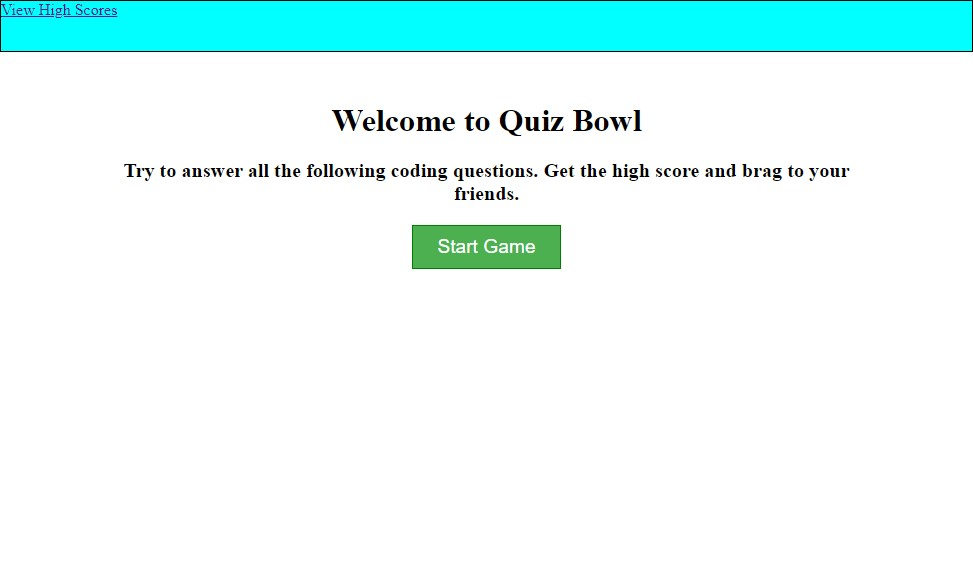

# Quiz Bowl

## Description
### A fun quiz game on coding concepts.

## Features
The game has 5 questions and a 30 second time limit.   
Correct answer give 10 points and incorrect answers will take 4 seconds of your time.   
Your time remaining is added as a bonus at the end of the game.   
You can enter your name and post your score to the leaderboard.   
Scores persist in your browser till you clear them.

